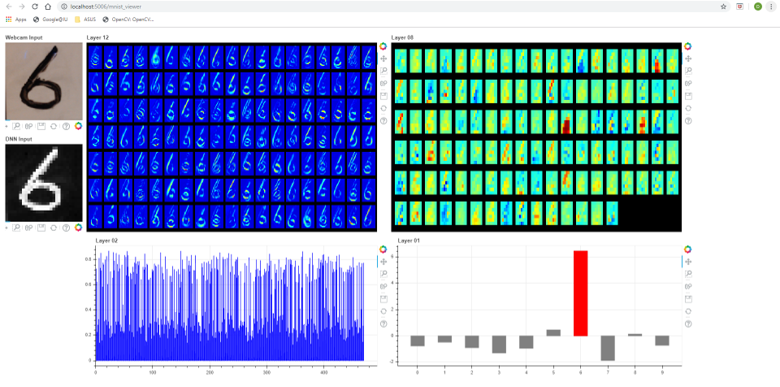

# MNIST Net Viewer #

This project is a python project that links to a network trained to recognize the MNIST dataset.  This project allows you visuallize serveral different layers within the network in real time as the webcam image is run through the network.

# Dependencies #

This project depends on the repo located here: https://github.com/davemers0160/mnist_dll

This repo compiles a netwrok built in the [dlib](dlib.net) framework into a .dll/.so file that can be run in other projects.  This library file is required by the code.

The python code requires the packages listed in the requirements.txt file.  To ensure the requirements are met run the following

```
pip install -r requirements.txt
```

# Setting up and Running the Vewer #


To run the code a little setup is required first:

1. Build the mnist_dll project to create the needed library
2. Edit the mnist_viewer.py file: 
   - modify "lib_location" to point to the correct library location
   - modify "weights_file" to point to the correct weights file location
3. Connect a webcam
4. Create a space to write the numbers.  This requires that there be a black/dark background with a white square where the number can be written.
5. Center the white square in the camera view
6. Run the code:

```
python -m bokeh serve --show mnist_viewer.py
```

The output should look similar to the following:



The output shows the cropped webcam view, the inverted and scaled input to the MNIST network, the output of layer 12, the output of layer 08, the output of layer 02 and the output of layer 01.


